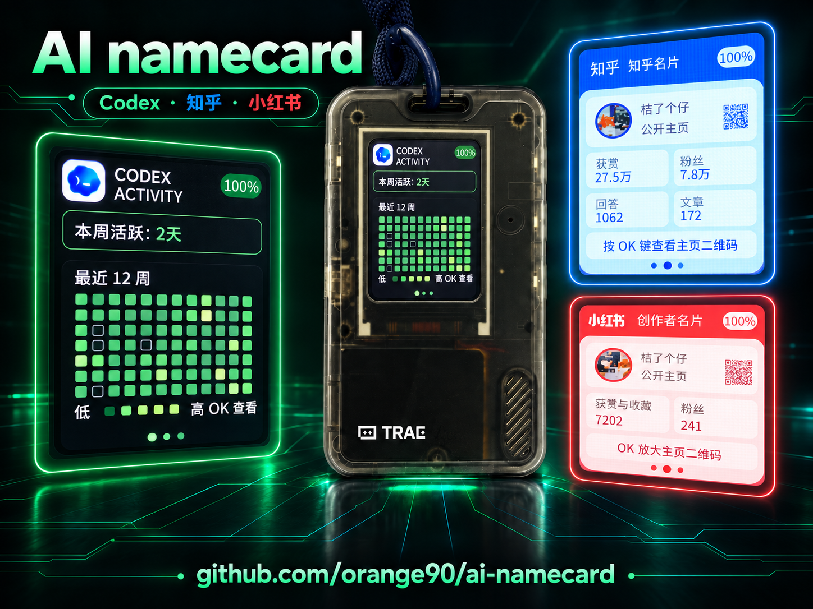
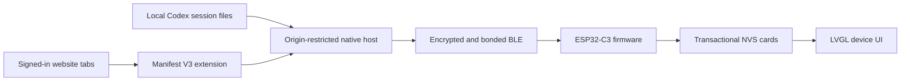

<p align="right">
  <a href="README.zh_CN.md">简体中文</a> · <strong>English</strong>
</p>

# AI Namecard (FoloCard)

AI Namecard is a FoloToy AI Passport firmware fork that turns the device into an offline card for Codex activity, Zhihu, and Xiaohongshu profiles. A local Chromium extension collects only after you click **Read data**, shows the exact device preview, and sends the confirmed card over encrypted Bluetooth LE.

This repository is an independent community fork of [FoloToy/ai-passport](https://github.com/FoloToy/ai-passport). It is not the official firmware, and its release files use the `ai-namecard` name to avoid being mistaken for upstream builds.



## What you need

- A FoloToy AI Passport with an ESP32-C3 and 8 MB Flash.
- A Chromium browser: Chrome, Brave, Edge, or Chromium.
- A Unix-like desktop environment and Python 3.10 or newer for the native messaging and BLE component. The bundled installer is intended for POSIX desktop systems.
- The two files from the [latest GitHub Release](https://github.com/orange90/ai-namecard/releases/latest):
  - `ai-namecard-full.bin`
  - `FoloCard-<version>-plugin.zip`
- `SHA256SUMS.txt` from the same Release if you want to verify the downloads.

## Install the firmware

The full image contains the bootloader, partition table, and `ai-namecard` application. Connect the device over USB, put it into download mode if necessary, and flash the image at `0x0` with Espressif's `esptool`:

```bash
python3 -m pip install --upgrade esptool
python3 -m esptool --chip esp32c3 --port PORT write_flash 0x0 ai-namecard-full.bin
```

Replace `PORT` with the device port, usually `/dev/cu.usbmodem*` or `/dev/ttyACM*`.

> Do not run `erase_flash`. Writing the full image at `0x0` clears ordinary NVS, so previously synchronized card data is reset; this is expected. The verified Release image ends before the protected `cardid` partition at `0x356000` and permanent Recovery at `0x700000`.

After reboot, the device should open the FoloCard screen. Use the physical buttons as follows:

| Control | Action |
| --- | --- |
| UP / DOWN | Switch among Codex, Zhihu, and Xiaohongshu cards |
| OK | Open or close the current card's detail view |
| Double-click OK | Open synchronization settings |
| OK in synchronization settings | Enable BLE synchronization for three minutes |
| Long-press OK | Return to the main card and cancel synchronization |

For partition details, alternative development flashing, and rollback guidance, see the [deployment guide](development/release/folocard-deployment.md).

## Install the browser plugin

FoloCard is distributed as an unpacked extension rather than through the Chrome Web Store.

1. Extract `FoloCard-<version>-plugin.zip`.
2. Open `chrome://extensions` in Chrome or Brave, or the equivalent extension page in Edge or Chromium.
3. Enable **Developer mode** and choose **Load unpacked**.
4. Select the extracted `FoloCard-<version>-plugin/extension` directory.
5. Copy the 32-character extension ID shown by the browser.
6. In a terminal, enter the extracted plugin directory and install the native component:

```bash
python3 -m venv .folocard-venv
.folocard-venv/bin/pip install -r requirements.txt
.folocard-venv/bin/python install_native.py --extension-id CHROME_EXTENSION_ID
```

Replace `CHROME_EXTENSION_ID` with the copied ID, then reload the extension. The default installation registers Chrome and Brave. For another browser, repeat the last command with `--browser edge` or `--browser chromium`.

The native component is required because a browser extension cannot directly read local Codex session files or connect to BLE through Python. It runs only when the installed extension requests a read or synchronization operation; it is not a background daemon and does not require a startup code.

## Read, preview, and synchronize

1. Sign in to Codex/ChatGPT, Zhihu, and Xiaohongshu in the same browser profile. Missing sites can be skipped.
2. Open FoloCard and click **Read data**. The extension searches the signed-in account pages and reads local Codex daily token counters through the native component.
3. Review the device preview. Successful sites update independently; a failed site keeps its previous card.
4. On the device, double-click OK, then press OK once to start the three-minute synchronization window.
5. In the extension, check the confirmation box and click **Synchronize to FoloCard**.
6. On first connection, enter the six-digit PIN shown by the device in the operating system's Bluetooth pairing dialog. The extension itself never asks for this PIN.

If the extension reports a BLE connection failure, first forget the existing **FoloCard** entry in the operating system's Bluetooth settings, then pair again.

## How it works



- **Browser collection:** dependency-free Manifest V3 JavaScript reads the current browser profile only after an explicit click. Website cookies and raw responses remain in the browser context.
- **Local Codex summary:** the Python native host scans `sessions/**/*.jsonl` and `archived_sessions/**/*.jsonl` under the configured Codex home. It returns daily numeric totals and coverage state, not authentication files or session contents.
- **Native messaging:** the browser launches `com.folotoy.folocard` through an origin allowlist tied to the installed extension ID. Normal extension operation uses standard input/output native messaging, not a local HTTP server.
- **BLE security:** the ESP32-C3 advertises as `FoloCard` only while the synchronization window is open. Characteristics require an encrypted, authenticated, bonded connection. Transfers use a declared length, CRC32, ordered chunks, and a commit acknowledgement.
- **Safe persistence:** incoming data is validated in RAM, written to the inactive NVS slot, and made active only after a successful commit. An invalid or interrupted transfer leaves the previous card available.
- **Device rendering:** the firmware uses ESP-IDF 5.5.3 and LVGL on a 240 × 320 display. Avatars from allowed image hosts are cropped locally and converted to a 24 × 24 RGB565 image before synchronization.

The complete JSON, BLE UUID, acknowledgement, validation, and storage contract is documented in [FoloCard design notes](assets/folocard.md).

## Data and privacy boundaries

FoloCard has no project-operated cloud backend and requires no API key. It still uses the websites you are signed in to, so those services' own networking and account policies continue to apply.

| Data | Handling |
| --- | --- |
| Browser cookies and account tokens | Stay inside the website/browser context; they are not sent to the native host or device |
| Public profile fields and selected usage values | Stored in extension-local storage after an explicit read and sent to the device only after confirmation |
| Local Codex session files | Read locally for counters; raw lines, prompts, and authentication files are not returned to the extension |
| Avatar source | Downloaded from declared image hosts, transformed locally, and embedded as RGB565 pixels; the original URL is not stored on the device |
| BLE pairing keys | Managed by the operating system and ESP32 stack; the extension and native host do not read them |

Do not publish browser profiles, native-host registration files, local virtual environments, pairing material, collected cards, device QR secrets, or unsanitized logs.

## Troubleshooting

| Problem | What to do |
| --- | --- |
| `Native host not found` | Confirm the extension ID, rerun `install_native.py`, and reload the extension |
| No FoloCard is found | Confirm Bluetooth is on and the device still shows the active synchronization window |
| BLE connection or PIN pairing fails | Forget the existing FoloCard system pairing and pair again; enter the device PIN only in the system dialog |
| A website cannot be read | Sign in, allow the extension's site access, use **Open to check**, then read again |
| Cards are empty after flashing | Full-image flashing clears ordinary NVS; read and synchronize the cards again |
| Data looks incomplete | Check each site's status and preview before confirming; website layouts and private/hidden fields can change |

The website adapters were last reviewed on 2026-09-08. They use current signed-in pages and selected website endpoints, not stable public APIs, so a future site change may require an extension update.

## Update or remove

To update, extract the new plugin bundle over a stable directory, reload the unpacked extension, and rerun `install_native.py` whenever the extension ID or native files change. Flashing a new full firmware image resets synchronized cards, so synchronize again afterward.

To remove FoloCard, remove the unpacked extension in the browser. The installed native files and browser registration are user-level files; their platform-specific locations are listed in the [desktop tools guide](../tools/folocard/README.md). Remove them manually only after closing the browser.

## Build from source

Firmware builds require ESP-IDF 5.5.3 for the ESP32-C3:

```bash
source /path/to/esp-idf-v5.5.3/export.sh
./tools/validate.sh --static
./tools/validate.sh --firmware
./tools/folocard/package-release.sh build/release
```

The release gate preserves the 3 MB factory application limit, `cardid` at `0x356000`, permanent Recovery at `0x700000`, and the five-second UP-key Recovery hook. A successful build is not a substitute for testing the released image on physical hardware; each Release reports those results separately.

## Project status and links

- [Releases and downloads](https://github.com/orange90/ai-namecard/releases)
- [Changelog](CHANGELOG.md)
- [Deployment guide](development/release/folocard-deployment.md)
- [Technical design](assets/folocard.md)
- [Issues and feedback](https://github.com/orange90/ai-namecard/issues)
- [Contributing](../.github/CONTRIBUTING.md) and [security policy](../.github/SECURITY.md)

This fork is under active community development. It targets the stated AI Passport hardware and is not a general ESP32-C3 firmware image. The onboard NTAG213 is a static passive NFC tag and cannot change its target according to the card currently shown on screen.

Licensed under the [Apache License 2.0](../LICENSE).
