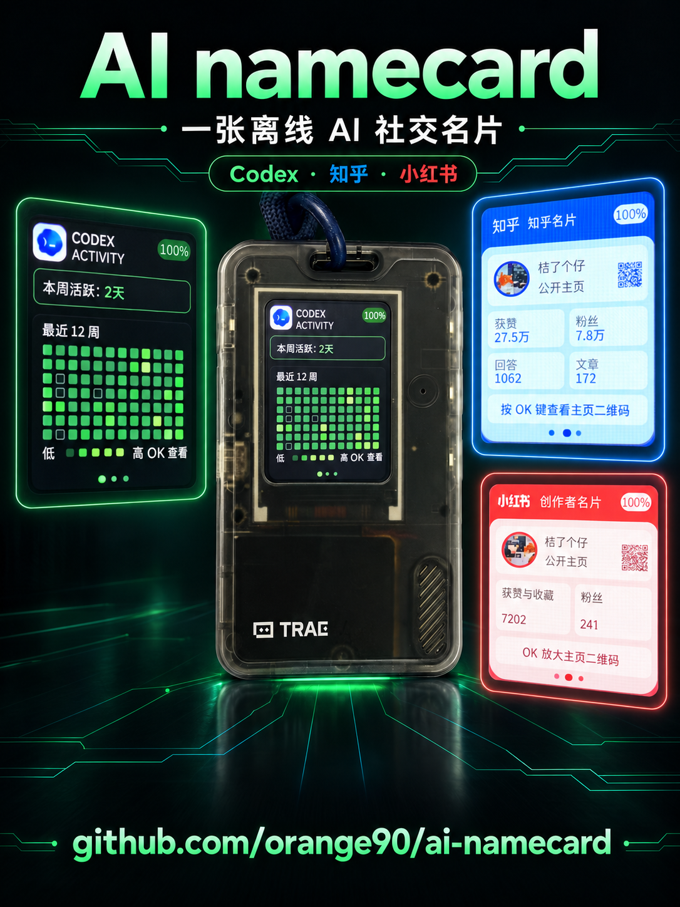
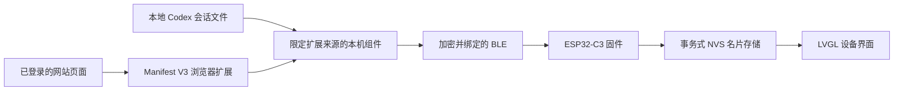

<p align="right">
  <strong>简体中文</strong> · <a href="README.md">English</a>
</p>

# AI Namecard（FoloCard）

AI Namecard 是基于 FoloToy AI Passport 改造的社区固件，把设备变成一张离线的 Codex 活跃度、知乎和小红书社交名片。Chromium 浏览器插件只会在你点击“一键读取数据”后采集，先展示与设备一致的预览，再把你确认过的名片通过加密 BLE 同步到设备。

本仓库是 [FoloToy/ai-passport](https://github.com/FoloToy/ai-passport) 的独立社区 fork，不是官方固件。Release 文件统一使用 `ai-namecard` 名称，避免与上游固件混淆。



## 使用前准备

- 一台采用 ESP32-C3、8 MB Flash 的 FoloToy AI Passport。
- Chromium 系浏览器：Chrome、Brave、Edge 或 Chromium。
- macOS 或 Linux，以及 Python 3.10 及以上版本，用于安装 Native Messaging 与 BLE 组件。目前没有提供 Windows 安装器。
- 从[最新 GitHub Release](https://github.com/orange90/ai-namecard/releases/latest)下载两个文件：
  - `ai-namecard-full.bin`
  - `FoloCard-<version>-plugin.zip`
- 如需校验下载文件，同时获取同一 Release 中的 `SHA256SUMS.txt`。

## 安装固件

完整镜像包含 bootloader、分区表和 `ai-namecard` 应用。通过 USB 连接设备，必要时让设备进入下载模式，然后使用 Espressif 的 `esptool` 将镜像写入 `0x0`：

```bash
python3 -m pip install --upgrade esptool
python3 -m esptool --chip esp32c3 --port PORT write_flash 0x0 ai-namecard-full.bin
```

将 `PORT` 替换成设备端口，例如 macOS 上的 `/dev/cu.usbmodem*` 或 Linux 上的 `/dev/ttyACM*`。

> 不要执行 `erase_flash`。从 `0x0` 写入完整镜像会清空普通 NVS，因此之前同步的名片数据会重置，这是正常现象。经过校验的 Release 镜像会在 `0x356000` 的受保护 `cardid` 分区和 `0x700000` 的永久 Recovery 之前结束。

设备重启后应进入 FoloCard 页面。实体按键操作如下：

| 操作 | 功能 |
| --- | --- |
| UP / DOWN | 在 Codex、知乎和小红书名片之间切换 |
| OK | 打开或关闭当前名片详情 |
| 双击 OK | 打开同步设置 |
| 在同步设置中按 OK | 开启三分钟 BLE 同步窗口 |
| 长按 OK | 返回主名片并取消同步 |

分区细节、开发时的其他烧录方式和回滚方法见 [部署说明](development/release/folocard-deployment.zh_CN.md)。

## 安装浏览器插件

FoloCard 目前不是 Chrome 应用商店插件，需要以“已解压扩展程序”方式安装。

1. 解压 `FoloCard-<version>-plugin.zip`。
2. 在 Chrome 或 Brave 打开 `chrome://extensions`；Edge 或 Chromium 使用对应的扩展管理页。
3. 开启“开发者模式”，点击“加载已解压的扩展程序”。
4. 选择解压后的 `FoloCard-<version>-plugin/extension` 目录。
5. 复制浏览器显示的 32 位扩展 ID。
6. 在终端进入解压后的插件目录，安装本机组件：

```bash
python3 -m venv .folocard-venv
.folocard-venv/bin/pip install -r requirements.txt
.folocard-venv/bin/python install_native.py --extension-id CHROME_EXTENSION_ID
```

把 `CHROME_EXTENSION_ID` 替换成刚复制的 ID，然后重新加载扩展。默认会为 Chrome 和 Brave 注册；其他浏览器可再次执行最后一条命令，并增加 `--browser edge` 或 `--browser chromium`。

本机组件是必需的，因为浏览器扩展不能直接读取本地 Codex 会话文件，也不能直接通过 Python 连接 BLE。它只在已安装扩展发起读取或同步时运行，不是后台常驻服务，也不需要启动码。

## 读取、预览与同步

1. 在同一浏览器配置中登录 Codex/ChatGPT、知乎和小红书；不需要的站点可以跳过。
2. 打开 FoloCard，点击“一键读取数据”。扩展会查找已登录账号页面，并通过本机组件读取本地 Codex 每日 Token 计数。
3. 检查设备效果预览。各站点独立更新，某一站点失败时会保留它原来的名片。
4. 在设备上双击 OK，再按一次 OK，开启三分钟同步窗口。
5. 在扩展中勾选确认框，点击“确认并同步到 FoloCard”。
6. 首次连接时，把设备显示的六位 PIN 填入操作系统的蓝牙配对弹窗。扩展本身不会索要 PIN。

如果扩展提示 BLE 连接失败，请先在系统蓝牙设置中忽略已有的 **FoloCard**，然后重新配对。

## 技术原理



- **浏览器采集：** 无构建依赖的 Manifest V3 JavaScript 只在明确点击后读取当前浏览器配置。网站 Cookie 和原始响应保留在浏览器上下文中。
- **本地 Codex 汇总：** Python 本机组件扫描指定 Codex 目录下的 `sessions/**/*.jsonl` 和 `archived_sessions/**/*.jsonl`，只返回每日数值合计和统计完整性状态，不返回认证文件或会话正文。
- **Native Messaging：** 浏览器通过与扩展 ID 绑定的来源白名单启动 `com.folotoy.folocard`。扩展的正常工作流使用标准输入输出的 Native Messaging，不依赖本地 HTTP 服务。
- **BLE 安全：** ESP32-C3 只在同步窗口开启时以 `FoloCard` 广播；特征要求加密、认证和绑定连接。传输包含声明长度、CRC32、有序分片和提交回执。
- **安全持久化：** 新数据先在 RAM 中校验，再写入非活动 NVS 槽，提交成功后才切换为当前数据。非法或中断的传输不会破坏上一份名片。
- **设备渲染：** 固件基于 ESP-IDF 5.5.3 和 LVGL，适配 240 × 320 屏幕。允许来源的头像在本机完成裁剪，并转换成 24 × 24 RGB565 图像后再同步。

完整 JSON、BLE UUID、回执、校验和存储契约见 [FoloCard 技术设计](assets/folocard.zh_CN.md)。

## 数据与隐私边界

FoloCard 没有项目自建的云端后端，也不需要 API Key；但它仍会访问你已登录的网站，因此这些服务自身的网络请求和账号规则依然适用。

| 数据 | 处理方式 |
| --- | --- |
| 浏览器 Cookie 与账号令牌 | 留在网站和浏览器上下文，不发送给本机组件或设备 |
| 公开资料字段与选定用量数值 | 明确点击读取后保存在扩展本地存储，确认同步后才发送到设备 |
| 本地 Codex 会话文件 | 只在本机读取计数；原始行、Prompt 和认证文件不会返回扩展 |
| 头像来源 | 从清单声明的图片站点获取，在本机转换并以 RGB565 像素写入名片；设备不保存原始 URL |
| BLE 配对密钥 | 由操作系统和 ESP32 协议栈管理，扩展与本机组件不会读取 |

不要公开浏览器配置、本机组件注册文件、本地虚拟环境、配对材料、已采集名片、设备二维码秘密参数或未脱敏日志。

## 常见问题

| 问题 | 处理方法 |
| --- | --- |
| 提示 `Native host not found` | 核对扩展 ID，重新运行 `install_native.py`，然后重新加载扩展 |
| 扫描不到 FoloCard | 确认系统蓝牙已开启，并确认设备仍显示同步窗口 |
| BLE 连接或 PIN 配对失败 | 在系统蓝牙设置中忽略已有的 FoloCard 后重新配对；PIN 只填入系统弹窗 |
| 某个网站读取失败 | 完成登录、允许扩展访问站点，点击“打开检查”，然后重新读取 |
| 烧录后名片为空 | 完整镜像会清空普通 NVS，请重新读取并同步名片 |
| 数据看起来不完整 | 确认每个站点状态并核对预览；网站页面结构以及私密或隐藏字段可能变化 |

网站适配器最后核对日期为 2026-09-08。它们依赖当前登录页面和部分网站内部接口，而不是稳定的公开 API；网站后续改版可能需要更新扩展。

## 更新或移除

更新时，把新插件包解压到固定目录，重新加载已解压扩展；如果扩展 ID 或本机文件发生变化，再次运行 `install_native.py`。重新烧录完整固件会清空已同步名片，之后需要再次同步。

移除时，先在浏览器中删除已解压扩展。本机组件与浏览器注册属于用户级文件，其 macOS 和 Linux 具体位置见 [桌面工具说明](../tools/folocard/README.zh_CN.md)；关闭浏览器后再手动删除。

## 从源码构建

固件构建需要 ESP-IDF 5.5.3 和 ESP32-C3 目标：

```bash
source /path/to/esp-idf-v5.5.3/export.sh
./tools/validate.sh --static
./tools/validate.sh --firmware
./tools/folocard/package-release.sh build/release
```

发布门禁会保留 3 MB factory 应用限制、`0x356000` 的 `cardid`、`0x700000` 的永久 Recovery，以及开机长按 UP 五秒进入 Recovery 的入口。构建成功不能代替真机验证；每个 Release 都会分别报告构建、主机测试和真机测试结果。

## 项目状态与链接

- [Release 与下载](https://github.com/orange90/ai-namecard/releases)
- [变更记录](CHANGELOG.zh_CN.md)
- [部署说明](development/release/folocard-deployment.zh_CN.md)
- [技术设计](assets/folocard.zh_CN.md)
- [问题与反馈](https://github.com/orange90/ai-namecard/issues)
- [参与贡献](../.github/CONTRIBUTING.zh_CN.md)与[安全政策](../.github/SECURITY.zh_CN.md)

这个 fork 仍在持续开发，只面向上述 AI Passport 硬件，并不是通用 ESP32-C3 固件。板载 NTAG213 是静态被动 NFC 标签，不能根据屏幕当前显示的名片动态切换跳转目标。

本项目采用 [Apache License 2.0](../LICENSE)。
